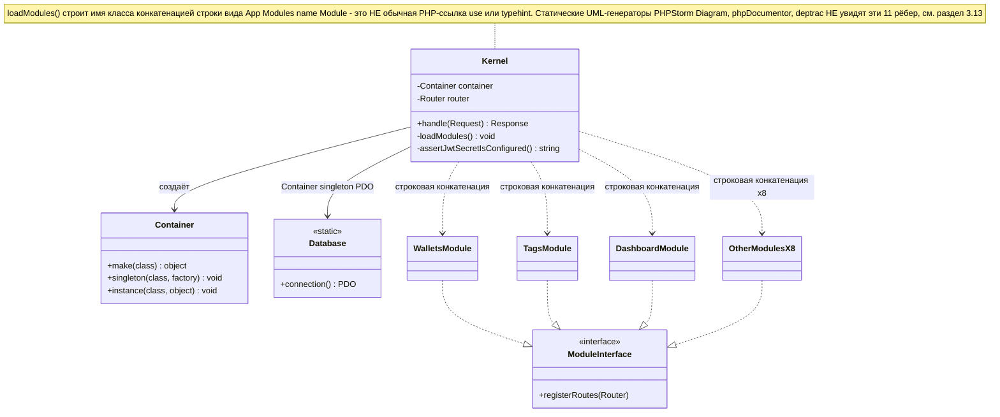
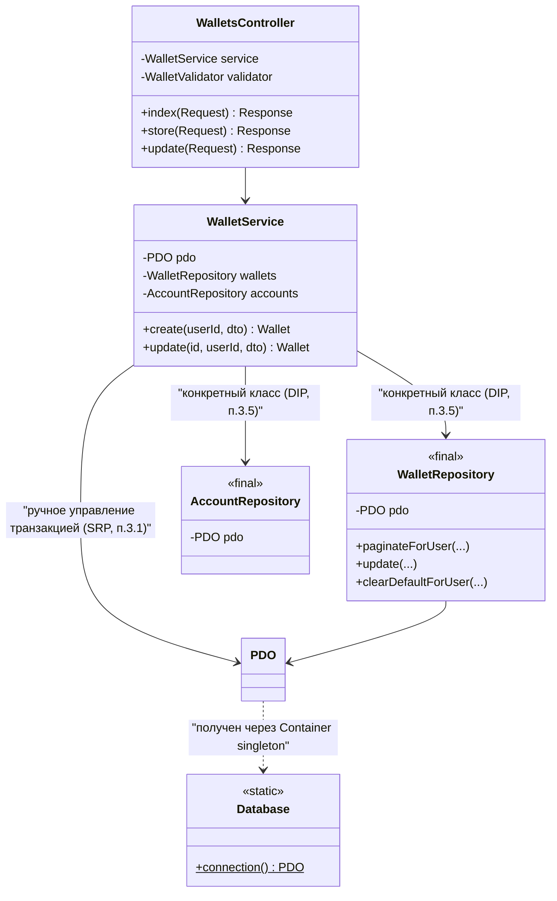
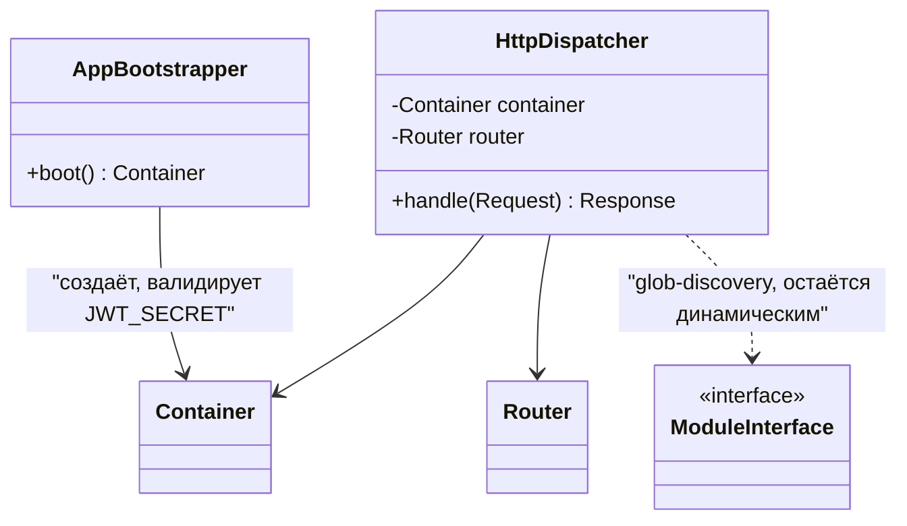
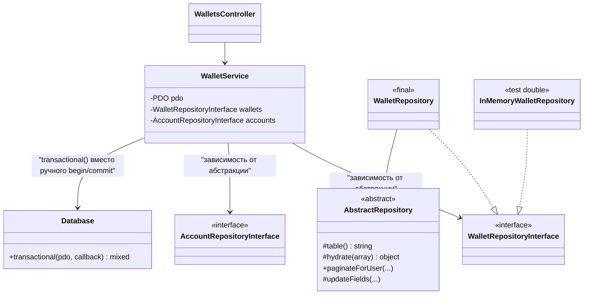

# Архитектурный аудит: SOLID, SoC, DRY, KISS, YAGNI, DI, UML

**Дата:** 2026-07-16

**Объект аудита:** `src/`, `bin/`, `public/index.php` (PHP 8.2+, без фреймворка)

**Метод:** построчное чтение реального кода репозитория (не по памяти/не абстрактно) — каждое утверждение ниже подкреплено файлом, строками и цитатой "до"; каждое предложение — кодом "после". Код "после" **иллюстративный** — в рамках этого аудита он не применён к рабочему дереву, только описан здесь.

---

## Используемые принципы (кратко)

| Принцип | Расшифровка | Суть одной фразой |
|---|---|---|
| **S**RP | Single Responsibility Principle | У класса должна быть одна причина для изменения — одна ответственность. |
| **O**CP | Open/Closed Principle | Система должна быть открыта для расширения, но закрыта для модификации существующего кода. |
| **L**SP | Liskov Substitution Principle | Объект подтипа должен без побочных эффектов подменять объект базового типа/интерфейса. |
| **I**SP | Interface Segregation Principle | Лучше несколько маленьких специализированных интерфейсов, чем один "толстый" с методами, которые не всем клиентам нужны. |
| **D**IP | Dependency Inversion Principle | Зависеть нужно от абстракций (интерфейсов), а не от конкретных реализаций; детали должны зависеть от политики, а не наоборот. |
| SoC | Separation of Concerns | Разные заботы системы (HTTP, бизнес-правила, хранение данных) должны жить в разных, слабо связанных частях кода. |
| DRY | Don't Repeat Yourself | Одно и то же знание/логика не должны быть продублированы в нескольких местах — иначе они разойдутся при следующем изменении. |
| KISS | Keep It Simple, Stupid | При прочих равных простое решение предпочтительнее сложного — сложность должна быть оправдана реальной задачей. |
| YAGNI | You Aren't Gonna Need It | Не строить абстракции и не добавлять гибкость под гипотетическое будущее, которого ещё не запросили. |
| DI / DI-контейнер | Dependency Injection | Зависимости передаются классу извне (обычно через конструктор), а не создаются им самим внутри `new`; контейнер автоматизирует сборку графа таких зависимостей. |
| UML | Unified Modeling Language | Нотация для визуализации структуры и связей системы; здесь используется как индикатор — то, что плохо ложится в понятную диаграмму (или невидимо для авто-генератора диаграмм), обычно и есть архитектурная проблема. |

*(S, O, L, I, D вместе образуют SOLID — пять принципов объектно-ориентированного дизайна; остальные в таблице — самостоятельные принципы, часто применяемые вместе с SOLID.)*

---

## 1. Итоговая сводка

| Принцип | Статус | Находок | Серьёзность |
|---|---|---|---|
| **S**RP | ⚠️ Нарушения есть | 2 | Средняя |
| **O**CP | ⚠️ Нарушение есть | 1 | Средняя |
| **L**SP | ✅ Существенных нарушений нет | 0 | — |
| **I**SP | ✅ Существенных нарушений нет | 0 | — |
| **D**IP | 🔴 Системное нарушение | 2 | Высокая |
| SoC | ⚠️ Есть смешение | 1 | Низкая |
| DRY | 🔴 Заметное дублирование | 4 (1 низкой важности) | Средняя-высокая |
| KISS | ⚠️ Спорный trade-off | 1 (не строгая находка) | Низкая |
| YAGNI | ⚠️ Есть преждевременная абстракция | 1 | Низкая |
| DI / DI-контейнер | ⚠️ Контейнер есть, но подрывается DIP | 2 | Высокая |
| UML / диаграммируемость | ⚠️ Есть "невидимая" связь | 1 | Средняя (для сопровождаемости) |

Легенда: 🔴 — стоит чинить в приоритете; ⚠️ — стоит чинить, но не горит; ✅ — не найдено, целенаправленно проверено.

---

## 2. UML — архитектура "до"

### 2.1 Системный уровень

[View on mermaid.live](https://mermaid.live/view#pako:eNqlVctu00AU_ZXRrBrVsZK4D8dCkVCzoEBF1YJAKJupfZuYxjNmZgwtpVJbJFhUqGLBkgV_UB4VgZZ-g-ePuHbiNk4fEqqlxOO555577pkZe5v6IgDqUb_PlGqHrCtZ1JEdTvDK58gDkBz6ZLuYza7qguCahRwk8YtRKb4iEo1Bmd_GI9M9xoM-TK3AywSUrpAVULHgCkrpfcGCJREkfVBTFfJKhEEpjLJA6vuv9Sr4EvSiQjnrYTeRECBcaRnybpGwU-7mQnipoemIbcBUDqkQsfYCfF0KK2TsgxZ8iLHIOvO1kFuXxU2HXGnGfSiQQ7YycEJUm2m2xhSUNd25g0Q69FutEj8azpEwRC0Vstx-dA3n0L5Fjv6j1kvUYRGYYJfQDRWG8gVUU8N1rFxT4ynroylqWKocesy6V863meqtCSaDq4KPdA_kaN2fuVmsiI82YbXaGltBj5i99Cz9lf5Mj8wns38F-NxZbyzvfDHH7Rsl2Xar3FZexeybXaz0B3_fsdYhyYd_8f_I7KfHODoy79OBObyC7cKJW1NNmHdrvrLf_0dHNt2CseyXbb9tTe6-AjnmxU2wyT5vwk70cB20gHOhgawLWdjQoeV3zbkDA7NP0kF6OrTgBNvew912dI0fOPo97t6AoH2DbGOSu3E8EqQIZxGMHkiVmI9IcUbSL-lnglnfzIH5kBMekuV7y9WsoDnA0liLJLiHkfAEmfVWDD08vzZJvyJBpmOAicco70-mhDxZelhNf-TijlFPBjgzu-YgY13Ft1ZERi96i8S9uC38JAKO8xYJINaS-UNJ5t2wB3OIVuRaB6ReJ8j0Kf2WMVvZ-Tu1SVYjP4XH6Qlx7LrTodSiXRkG1NMyAYtGICOWPdLtbBk6FBctgg71cBgwudGhHb6DOTHjz4WIijT8fHR71FtnfYVPSRwwDSPp5xDgAcgFkXBNvXknp6DeNt2kXtOu1dyG25ibq884803XtegW9equ3XBma81Gfc6pubNNx92x6Ju8aN2uzTgIdWcaTceZm61bFIIQjVkafSOz284_BTXr_w)



Точная сигнатура строки, которую строит `Kernel::loadModules()` (см. код в разделе 3.13): `"App\Modules\{$name}\Module"` — конкатенация, а не PHP-ссылка (`use`/тайп-хинт), поэтому на диаграмме выше это показано пунктирной линией `..>`, а не сплошной.

### 2.2 Модуль Wallets (детализация — типичный срез слоёв)



**Что видно на диаграмме:** `WalletService` зависит от *реализаций* (`WalletRepository`, `AccountRepository`), а не от абстракций — интерфейсов между слоями Service→Repository в текущей архитектуре нет вообще ни у одного из 8 репозиториев.

---

## 3. Находки

### 3.1 SRP — `Kernel` совмещает bootstrap, валидацию конфига и HTTP-диспетчеризацию

**До** — [`src/Core/Kernel.php`](../src/Core/Kernel.php):

```php
final class Kernel
{
    public function __construct()
    {
        $jwtSecret = $this->assertJwtSecretIsConfigured();   // (1) валидация конфига
        $this->container = new Container();                  // (2) bootstrap DI
        $this->router = new Router();
        $this->container->instance(Router::class, $this->router);
        $this->container->singleton(\PDO::class, static fn () => Database::connection());
        $this->container->singleton(Jwt::class, static fn () => new Jwt($jwtSecret));
        $this->loadModules();                                 // (3) регистрация модулей
    }

    private function assertJwtSecretIsConfigured(): string { /* ... */ }
    private function loadModules(): void { /* ... */ }

    public function handle(Request $request): Response          // (4) HTTP-диспетчер
    {
        // CORS preflight, роутинг, сборка middleware-цепочки, вызов контроллера,
        // перехват исключений — всё в одном методе на ~40 строк
    }
}
```

Один класс отвечает за: 
1. валидацию окружения
2. построение DI-графа
3. обнаружение и регистрацию модулей
4. HTTP-роутинг и middleware-пайплайн.

У класса **четыре независимых причины для изменения** — это ровно то, чего не должно быть при соблюдении SRP.

**После** — разделить на `Kernel` (только orchestration верхнего уровня), `AppBootstrapper` (валидация конфига + сборка контейнера) и `HttpDispatcher` (routing + middleware):

```php
final class AppBootstrapper
{
    public function boot(): Container
    {
        $jwtSecret = $this->assertJwtSecretIsConfigured();

        $container = new Container();
        $container->singleton(\PDO::class, static fn () => Database::connection());
        $container->singleton(Jwt::class, static fn () => new Jwt($jwtSecret));

        return $container;
    }

    private function assertJwtSecretIsConfigured(): string { /* как было */ }
}

final class HttpDispatcher
{
    public function __construct(private readonly Container $container, private readonly Router $router) {}

    public function handle(Request $request): Response { /* как было в Kernel::handle() */ }
}

// public/index.php
$container = (new AppBootstrapper())->boot();
$router = new Router();
$container->instance(Router::class, $router);
ModuleRegistry::registerAll($container, $router); // см. фикс OCP ниже
(new HttpDispatcher($container, $router))->handle(Request::fromGlobals())->send();
```

Каждый класс теперь читается и тестируется независимо: `AppBootstrapper` можно проверить без единого HTTP-запроса, `HttpDispatcher` — без забот о том, как настроен JWT.

---

### 3.2 SRP — `TransactionService`/`WalletService` управляют транзакциями БД внутри бизнес-методов

**До** — [`src/Modules/Transactions/Services/TransactionService.php:49-65`](../src/Modules/Transactions/Services/TransactionService.php):

```php
public function create(int $userId, CreateTransactionDTO $dto): Transaction
{
    $this->assertWalletOwnership($dto->walletId, $userId);
    $this->assertCategoryOwnership($dto->categoryId, $userId);
    $tagIds = $this->assertTagsOwnership($dto->tagIds, $userId);

    $this->pdo->beginTransaction();
    try {
        $id = $this->transactions->create(/* ... */);
        $this->transactions->syncTags($id, $tagIds);
        $this->wallets->recalculateBalance($dto->walletId);
        $this->pdo->commit();
    } catch (\Throwable $e) {
        $this->pdo->rollBack();
        throw $e;
    }

    return $this->getForUser($id, $userId);
}
```

Тот же блок `beginTransaction/commit/catch/rollBack` **дословно повторён 5 раз** в двух сервисах (см. также находку DRY 3.6) — то есть каждый сервис вручную реализует стратегию управления транзакциями, хотя это сквозная (cross-cutting) забота, а не часть бизнес-правила "создать транзакцию".

**После** — вынести в переиспользуемый хелпер (заодно закрывает и находку DRY 3.6):

```php
// src/Core/Database.php — добавить метод
final class Database
{
    public static function transactional(\PDO $pdo, \Closure $callback): mixed
    {
        $pdo->beginTransaction();
        try {
            $result = $callback();
            $pdo->commit();
            return $result;
        } catch (\Throwable $e) {
            $pdo->rollBack();
            throw $e;
        }
    }
}
```

```php
// TransactionService::create() — после
public function create(int $userId, CreateTransactionDTO $dto): Transaction
{
    $this->assertWalletOwnership($dto->walletId, $userId);
    $this->assertCategoryOwnership($dto->categoryId, $userId);
    $tagIds = $this->assertTagsOwnership($dto->tagIds, $userId);

    $id = Database::transactional($this->pdo, function () use ($userId, $dto, $tagIds) {
        $id = $this->transactions->create(
            $userId, $dto->walletId, $dto->categoryId, $dto->type, $dto->amount, $dto->description, $dto->date,
        );
        $this->transactions->syncTags($id, $tagIds);
        $this->wallets->recalculateBalance($dto->walletId);

        return $id;
    });

    return $this->getForUser($id, $userId);
}
```

Метод "create" теперь читается как последовательность бизнес-шагов, а не как ручное управление транзакцией + бизнес-шаги вперемешку.

---

### 3.3 OCP — список модулей и middleware зашиты в константы `Kernel`

**До** — [`src/Core/Kernel.php:19-38`](../src/Core/Kernel.php):

```php
private const MIDDLEWARE_MAP = [
    'auth' => AuthMiddleware::class,
];

private const MODULES = [
    'Users', 'Auth', 'Accounts', 'Wallets', 'Categories',
    'Tags', 'Transactions', 'Settings', 'Dashboard', 'System', 'EmailVerification',
];
```

Чтобы добавить 12-й модуль, разработчик обязан открыть `Kernel.php` (класс ядра фреймворка) и вписать туда строку — система не открыта для расширения без модификации существующего кода. То же самое для именованного middleware.

**После** — обнаружение модулей по файловой структуре вместо явного перечисления:

```php
private function loadModules(): void
{
    foreach (glob(__DIR__ . '/../Modules/*/Module.php') as $moduleFile) {
        $name = basename(dirname($moduleFile));
        /** @var class-string<ModuleInterface> $moduleClass */
        $moduleClass = "App\\Modules\\{$name}\\Module";
        $this->container->make($moduleClass)->registerRoutes($this->router);
    }
}
```

Добавление модуля становится вопросом "создать директорию `src/Modules/NewThing/` с `Module.php`", а не "отредактировать `Kernel.php`".

> ⚠️ **Честная оговорка:** этот фикс закрывает OCP, но **не** закрывает находку 3.7 (UML/диаграммируемость) — имя класса всё ещё строится конкатенацией строки, а не статической PHP-ссылкой. Это два разных свойства кода, и второе является неизбежной ценой любого механизма auto-discovery (та же цена есть у Laravel/Symfony service discovery).

---

### 3.4 LSP и ISP — существенных нарушений не найдено

Целенаправленно проверено: в кодовой базе всего два интерфейса (`ModuleInterface`, `MiddlewareInterface`), оба — с одним методом, оба реализуются консистентно (все `Module.php` и оба middleware ведут себя предсказуемо для контракта). Глубокой иерархии наследования нет вообще (наследование не используется ни разу за пределами исключений `App\Core\Exceptions\*`, которые единообразно наследуют `ApiException` и корректно передают `httpStatus`/`errorCode` — замены базового поведения нигде нет). LSP-риск в такой архитектуре структурно низкий. Реальная проблема с абстракциями — не "интерфейсы слишком толстые" (ISP), а "интерфейсов почти нет там, где они нужны" — см. DIP (3.5).

---

### 3.5 DIP — сервисы зависят от конкретных `final`-репозиториев, а не от абстракций

**До** — [`src/Modules/Wallets/Services/WalletService.php:17-22`](../src/Modules/Wallets/Services/WalletService.php):

```php
final class WalletService
{
    public function __construct(
        private readonly \PDO $pdo,
        private readonly WalletRepository $wallets,      // конкретный класс
        private readonly AccountRepository $accounts,    // конкретный класс
    ) {}
}
```

Так устроены **все 8 репозиториев** проекта (`grep -L "^final class" src/Modules/*/Repositories/*.php` — пусто, то есть исключений нет). Это прямое нарушение "зависеть от абстракций, а не от реализаций" — и не абстрактная претензия: **это уже стоило реальной работы в этом самом проекте.** Когда потребовалось юнит-тестировать `AuthService`/`WalletService`/`CategoryService`, PHPUnit-моки оказались невозможны именно из-за `final class` без интерфейса — пришлось поднимать интеграционные тесты на реальном MySQL (`tests/Integration/`) там, где при соблюдении DIP хватило бы быстрого юнит-теста с фейковым репозиторием в памяти.

**После** — извлечь интерфейс на границе Service↔Repository:

```php
// src/Modules/Wallets/Contracts/WalletRepositoryInterface.php
interface WalletRepositoryInterface
{
    public function findForUser(int $id, int $userId): ?Wallet;
    public function create(int $userId, ?int $accountId, string $name, string $currency, bool $isDefault): Wallet;
    public function update(int $id, int $userId, array $fields): ?Wallet;
    public function clearDefaultForUser(int $userId, ?int $exceptWalletId = null): void;
    // ...
}

final class WalletRepository implements WalletRepositoryInterface
{
    // реализация не меняется ни на строку
}
```

```php
// WalletService — меняется только type hint в конструкторе
final class WalletService
{
    public function __construct(
        private readonly \PDO $pdo,
        private readonly WalletRepositoryInterface $wallets,
        private readonly AccountRepositoryInterface $accounts,
    ) {}
}
```

```php
// Kernel/bootstrap — явный бинд абстракции на реализацию
$container->singleton(WalletRepositoryInterface::class, fn ($c) => $c->make(WalletRepository::class));
```

Теперь юнит-тест бизнес-правила "is_default эксклюзивен" не требует поднятого MySQL:

```php
final class InMemoryWalletRepository implements WalletRepositoryInterface
{
    /** @var Wallet[] */ private array $wallets = [];
    public function clearDefaultForUser(int $userId, ?int $exceptWalletId = null): void { /* массив в памяти */ }
    // ...
}

// WalletServiceTest.php — миллисекунды, без Docker
$service = new WalletService($fakePdo, new InMemoryWalletRepository(), new InMemoryAccountRepository());
```

---

### 3.6 DIP — `Database::connection()` как статический синглтон обходит DI-контейнер

**До** — [`src/Core/Database.php`](../src/Core/Database.php):

```php
final class Database
{
    private static ?\PDO $connection = null;

    public static function connection(): \PDO
    {
        if (self::$connection === null) {
            /* ... */
        }
        return self::$connection;
    }
}
```

Это классический Singleton (не DI!) — глобальное изменяемое состояние, доступное из **любой точки кода** в обход контейнера. Формально `Kernel` регистрирует `\PDO::class` в контейнере через `Database::connection()`, но ничто не мешает любому будущему классу написать `Database::connection()` напрямую внутри метода, минуя конструкторную инъекцию — и такой код пройдёт код-ревью незаметно, потому что синтаксически неотличим от легитимного использования в `bin/migrate.php`/`bin/health-check.php` (где статический вызов уместен — это CLI-скрипты вне DI-графа приложения).

**После** — не убирать статический доступ полностью (он реально нужен CLI-скриптам `bin/*.php`, которые не поднимают `Kernel`/`Container`), а явно разделить два случая пометкой области допустимого использования:

```php
/**
 * @internal Только для bin/*.php и Kernel::boot(). Классы внутри src/Modules
 * обязаны получать \PDO через конструкторную инъекцию (Container::singleton),
 * а не звать этот метод напрямую — иначе класс становится нетестируемым
 * так же, как WalletRepository/AuthService (см. DIP-находку 3.5).
 */
final class Database
{
    public static function connection(): \PDO { /* без изменений */ }
}
```

Это не технический фикс (PHP не может ограничить видимость статического метода по "духу", а не по namespace), а фиксация архитектурного правила словами прямо у источника проблемы + добавление правила в статический анализ (например, [Deptrac](https://github.com/deptrac/deptrac) или PHPStan-правило "запретить `Database::connection()` вне `bin/` и `Core/`") — то есть перевод неявного соглашения в проверяемое.

---

### 3.7 SoC — контроллеры вручную парсят и приводят типы сырых данных запроса

**До** — [`src/Modules/Transactions/Controllers/V1/TransactionsController.php:53-68`](../src/Modules/Transactions/Controllers/V1/TransactionsController.php):

```php
public function store(Request $request): Response
{
    $data = $request->all();
    $errors = $this->validator->validateCreate($data);
    if ($errors !== []) {
        throw BadRequestException::validation($errors);
    }

    $transaction = $this->service->create($request->userId(), new CreateTransactionDTO(
        (int) $data['wallet_id'],
        (int) $data['category_id'],
        (string) $data['type'],
        (float) $data['amount'],
        $data['description'] ?? null,
        (string) $data['date'],
        array_map('intval', $data['tags'] ?? []),
    ));

    return Response::success($transaction->toArray(), null, 201);
}
```

Контроллер отвечает не только за оркестрацию (validate → вызвать сервис → сформировать ответ), но и за знание точной сигнатуры конструктора DTO **по позиции параметров** — при добавлении нового поля в `CreateTransactionDTO` легко перепутать порядок аргументов и получить не ошибку компиляции, а тихо неверные данные (типы `int`/`string`/`float` совпадут, компилятор не поможет).

**После** — именованный фабричный метод на самом DTO, конструирование "рядом с данными":

```php
final class CreateTransactionDTO
{
    private function __construct(
        public readonly int $walletId,
        public readonly int $categoryId,
        public readonly string $type,
        public readonly float $amount,
        public readonly ?string $description,
        public readonly string $date,
        public readonly array $tagIds,
    ) {}

    public static function fromRequestData(array $data): self
    {
        return new self(
            walletId: (int) $data['wallet_id'],
            categoryId: (int) $data['category_id'],
            type: (string) $data['type'],
            amount: (float) $data['amount'],
            description: $data['description'] ?? null,
            date: (string) $data['date'],
            tagIds: array_map('intval', $data['tags'] ?? []),
        );
    }
}
```

```php
// Контроллер — после
$transaction = $this->service->create($request->userId(), CreateTransactionDTO::fromRequestData($data));
```

Именованные аргументы внутри `fromRequestData()` делают порядок неважным, а контроллер сокращается до одной читаемой строки на построение DTO.

---

### 3.8 DRY — `Module.php` идентичен во всех 11 модулях

**До** — сравнение [`src/Modules/Tags/Module.php`](../src/Modules/Tags/Module.php) и [`src/Modules/Dashboard/Module.php`](../src/Modules/Dashboard/Module.php) (и ещё 9 файлов с тем же телом):

```php
// Tags/Module.php
final class Module implements ModuleInterface
{
    public function registerRoutes(Router $router): void
    {
        require __DIR__ . '/Routes/v1.php';
    }
}

// Dashboard/Module.php — тело 1-в-1, отличается только namespace
final class Module implements ModuleInterface
{
    public function registerRoutes(Router $router): void
    {
        require __DIR__ . '/Routes/v1.php';
    }
}
```

11 файлов, единственное отличие между которыми — строка `namespace`. Ноль вариативности поведения.

**После** — устранить сам класс-маркер там, где он не несёт уникальной логики, и обнаруживать `Routes/v1.php` напрямую (объединяется с фиксом OCP 3.3):

```php
// Kernel::loadModules() — после
private function loadModules(): void
{
    $router = $this->router; // require ниже видит $router через текущую область видимости
    foreach (glob(__DIR__ . '/../Modules/*/Routes/v1.php') as $routesFile) {
        require $routesFile;
    }
}
```

`ModuleInterface` и все 11 `Module.php` удаляются полностью — 44 строки шаблонного кода без единой уникальной строки исчезают.

> ⚠️ **Честная оговорка:** если модулям в будущем понадобится что-то за пределами регистрации маршрутов (например, подписка на события, регистрация собственных CLI-команд, health-check-хуки) — понадобится вернуть класс-маркер с более широким контрактом (`boot()`, `registerRoutes()`, ...). До тех пор, пока такой необходимости не появилось, держать пустой класс "на будущее" — само по себе близко к находке YAGNI (3.10).

---

### 3.9 DRY — CRUD-репозитории дублируют `paginateForUser()`/`update()` почти дословно

**До** — [`AccountRepository::paginateForUser()`](../src/Modules/Accounts/Repositories/AccountRepository.php) и [`TagRepository::paginateForUser()`](../src/Modules/Tags/Repositories/TagRepository.php) (структура идентична также в `CategoryRepository`):

```php
// AccountRepository
public function paginateForUser(int $userId, int $page, int $perPage): array
{
    $offset = ($page - 1) * $perPage;
    $stmt = $this->pdo->prepare(
        'SELECT * FROM accounts WHERE user_id = :user_id ORDER BY id DESC LIMIT :limit OFFSET :offset'
    );
    $stmt->bindValue('user_id', $userId, \PDO::PARAM_INT);
    $stmt->bindValue('limit', $perPage, \PDO::PARAM_INT);
    $stmt->bindValue('offset', $offset, \PDO::PARAM_INT);
    $stmt->execute();
    $items = array_map(Account::fromRow(...), $stmt->fetchAll());

    $countStmt = $this->pdo->prepare('SELECT COUNT(*) FROM accounts WHERE user_id = :user_id');
    $countStmt->execute(['user_id' => $userId]);
    $total = (int) $countStmt->fetchColumn();

    return ['items' => $items, 'total' => $total];
}

// TagRepository — то же самое, "accounts"→"tags", Account::fromRow→Tag::fromRow
```

То же самое дословно повторяется для `update()` (динамическая сборка `SET`, см. 3.5 diff). Три репозитория (`Account`, `Tag`, `Category`) продублировали этот код без единого структурного отличия.

**После** — общая база с шаблонным методом:

```php
// src/Core/AbstractRepository.php
abstract class AbstractRepository
{
    public function __construct(protected readonly \PDO $pdo) {}

    abstract protected function table(): string;
    abstract protected function hydrate(array $row): object;

    public function paginateForUser(int $userId, int $page, int $perPage): array
    {
        $table = $this->table();
        $offset = ($page - 1) * $perPage;

        $stmt = $this->pdo->prepare(
            "SELECT * FROM {$table} WHERE user_id = :user_id ORDER BY id DESC LIMIT :limit OFFSET :offset"
        );
        $stmt->bindValue('user_id', $userId, \PDO::PARAM_INT);
        $stmt->bindValue('limit', $perPage, \PDO::PARAM_INT);
        $stmt->bindValue('offset', $offset, \PDO::PARAM_INT);
        $stmt->execute();
        $items = array_map($this->hydrate(...), $stmt->fetchAll());

        $countStmt = $this->pdo->prepare("SELECT COUNT(*) FROM {$table} WHERE user_id = :user_id");
        $countStmt->execute(['user_id' => $userId]);

        return ['items' => $items, 'total' => (int) $countStmt->fetchColumn()];
    }

    protected function updateFields(int $id, int $userId, array $fields): void
    {
        if ($fields === []) {
            return;
        }
        $table = $this->table();
        $assignments = implode(', ', array_map(static fn ($f) => "{$f} = :{$f}", array_keys($fields)));
        $stmt = $this->pdo->prepare("UPDATE {$table} SET {$assignments} WHERE id = :id AND user_id = :user_id");
        $stmt->execute([...$fields, 'id' => $id, 'user_id' => $userId]);
    }
}
```

```php
// TagRepository — после: только то, что реально специфично для Tag
final class TagRepository extends AbstractRepository implements TagRepositoryInterface
{
    protected function table(): string { return 'tags'; }
    protected function hydrate(array $row): Tag { return Tag::fromRow($row); }

    public function findForUser(int $id, int $userId): ?Tag { /* ...специфичный SELECT... */ }
    public function create(int $userId, string $name, string $color): Tag { /* ...специфичный INSERT... */ }
    public function update(int $id, int $userId, array $fields): ?Tag
    {
        $this->updateFields($id, $userId, $fields);
        return $this->findForUser($id, $userId);
    }
}
```

> ⚠️ **Честная оговорка (KISS-компромисс):** абстрактный базовый класс возвращает вязкость наследования, которой в проекте сейчас нигде больше нет, и подстановка имени таблицы через `{$table}` чуть менее "grep-friendly", чем полностью инлайновый SQL в каждом репозитории. Выигрыш — реальный (≈120 строк дублирования → ~40 общих + тонкие подклассы), но это осознанный компромисс, а не бесплатный рефакторинг. Если репозиториев станет ещё больше (сейчас 8) — выигрыш будет расти быстрее цены.

---

### 3.10 YAGNI — `WidgetRegistry` строит расширяемый реестр ради двух виджетов

**До** — [`src/Modules/Dashboard/Services/WidgetRegistry.php`](../src/Modules/Dashboard/Services/WidgetRegistry.php):

```php
final class WidgetRegistry
{
    private readonly array $widgets;

    public function __construct(BalanceChartWidget $balanceChart, ExpensesByCategoryWidget $expensesByCategory)
    {
        $this->widgets = [
            $balanceChart->name() => $balanceChart,
            $expensesByCategory->name() => $expensesByCategory,
        ];
    }

    public function names(): array { return array_keys($this->widgets); }
    public function get(string $name): WidgetInterface { /* ... */ }
}
```

Плюс отдельный `WidgetInterface`. На данный момент виджетов ровно два, оба захардкожены в конструкторе (не загружаются из конфига, не подключаются пользователем) — то есть сама "регистрируемость" реестра нигде не используется: список виджетов так же статичен, как если бы это был `match`. Это преждевременная общность под гипотетическое будущее "плагинов виджетов", которого пока не запрошено.

**После** — прямой `match` без промежуточного слоя:

```php
final class DashboardController
{
    public function __construct(
        private readonly BalanceChartWidget $balanceChart,
        private readonly ExpensesByCategoryWidget $expensesByCategory,
    ) {}

    public function list(Request $request): Response
    {
        return Response::success(['balance-chart', 'expenses-by-category']);
    }

    public function show(Request $request): Response
    {
        $name = (string) $request->param('name');
        $widget = match ($name) {
            'balance-chart' => $this->balanceChart,
            'expenses-by-category' => $this->expensesByCategory,
            default => throw new NotFoundException("Widget '{$name}' not found"),
        };

        return Response::success($widget->data($request->userId()));
    }
}
```

`WidgetInterface` и `WidgetRegistry` удаляются (≈30 строк). Это низкоприоритетная находка: реестр не наносит вреда, только несёт неоправданную сейчас косвенность. **Стоит вернуть**, как только появится третий+ виджет с конфигурацией/условной регистрацией — то есть ровно тот момент, когда обобщение перестанет быть преждевременным.

---

### 3.11 KISS — reflection-автовайринг `Container` (обсуждение, не строгая находка)

**Код** — [`src/Core/Container.php:52-84`](../src/Core/Container.php) — рекурсивно резолвит зависимости конструктора через `ReflectionClass`.

Это не нарушение в чистом виде — скорее пограничный trade-off, который стоит явно проговорить. С одной стороны: полноценный reflection-контейнер — дополнительная "магия" (труднее проследить, как именно собирается объект, не читая рефлексию в голове; ошибки резолвинга проявляются как `RuntimeException` в рантайме, а не как ошибка компиляции/статического анализа). Для 11 модулей × ~5 классов на модуль вручную регистрировать каждый биндинг было бы избыточно многословно.

**Вывод:** оставить как есть. Автовайринг убирает реальный объём ручного кода (≈60+ классов), а его "магичность" ограничена простым, предсказуемым правилом (типизированный конструкторный параметр → рекурсивный `make()`). Это тот случай, когда TODO-лист аудита должен явно сказать "не трогать", а не найти нарушение любой ценой.

---

### 3.12 DI-контейнер — сильные и слабые стороны сведены воедино

**Сильная сторона (не находка, для баланса):** конструкторная инъекция используется **консистентно** во всём проекте — ни один Service/Controller не тянет зависимости через `new` внутри тела метода или через сервис-локатор в рантайме. Единственная статическая точка входа — `Database::connection()` (см. 3.6), и она сосредоточена в одном месте, а не размазана.

**Слабая сторона:** ценность самого наличия DI-контейнера частично нивелируется находкой DIP (3.5) — контейнер в этом проекте используется практически исключительно как *convenience-автовайринг* (не писать `new X(new Y(new Z()))` руками), а не как механизм *подстановки реализаций* (что обычно и есть главная причина заводить контейнер вообще). Пока сервисы типизированы на конкретные классы, контейнер не даёт того, ради чего DI-контейнеры существуют в первую очередь — возможности подменить реализацию (тестовую, альтернативную, decorator) без правки кода потребителя.

**Фикс** — см. 3.5: после извлечения интерфейсов контейнер начинает делать содержательную работу — `$container->singleton(WalletRepositoryInterface::class, ...)` становится точкой, где решается "какая реализация" отдельно от того, "как её собрать".

---

### 3.13 UML / диаграммируемость — динамическое построение имени класса невидимо для инструментов

**До** — [`src/Core/Kernel.php:75-83`](../src/Core/Kernel.php):

```php
private function loadModules(): void
{
    foreach (self::MODULES as $name) {
        $moduleClass = "App\\Modules\\{$name}\\Module";   // строка, не PHP-ссылка
        $module = $this->container->make($moduleClass);
        $module->registerRoutes($this->router);
    }
}
```

Любой инструмент, который строит UML/граф зависимостей по статическому анализу кода (PHPStorm "Show Diagram", `phpDocumentor`, [Deptrac](https://github.com/qossmic/deptrac), `php-ast`-парсеры) находит рёбра графа через реальные PHP-конструкции — `use`, тайп-хинты, `new Class()`, `instanceof`. Конкатенация строки `"App\\Modules\\{$name}\\Module"` — не такая конструкция: связь `Kernel → Modules\Wallets\Module` существует только в рантайме, и ни один авто-генератор диаграмм её не покажет. С точки зрения статических инструментов у `Kernel` **нет исходящих рёбер** к модулям вообще, хотя рантайм-связь — самая важная в системе (без неё не зарегистрируется ни один маршрут).

**Последствие:** диаграммы в этом документе (раздел 2) пришлось строить вручную чтением кода, а не автогенерацией — авто-инструмент такую диаграмму просто не построит корректно.

**После — частично неисправимо, но не "молча":** ни один вариант auto-discovery (в т.ч. предложенный фикс OCP 3.3 через `glob()`) не устраняет саму природу проблемы — discovery *обязан* быть динамическим, чтобы решать задачу "не редактировать ядро при добавлении модуля" (см. 3.3). Правильный ответ — не притворяться, что связь статическая, а сделать её видимой явно, раз инструменты её не видят:

1. Зафиксировать инвариант тестом:
   ```php
   final class ModuleDiscoveryTest extends TestCase
   {
       public function testEveryModuleDirectoryHasARegistrableModuleClass(): void
       {
           foreach (glob(__DIR__ . '/../../src/Modules/*/Module.php') as $file) {
               $class = 'App\\Modules\\' . basename(dirname($file)) . '\\Module';
               self::assertTrue(class_exists($class));
               self::assertTrue(is_subclass_of($class, ModuleInterface::class) || $class === ModuleInterface::class);
           }
       }
   }
   ```
2. Держать ровно такую диаграмму, как в разделе 2, в документации рядом с кодом (а не полагаться на то, что IDE её сама нарисует) — что этот документ и делает.

---

## 4. UML — предлагаемая архитектура "после"

### 4.1 Системный уровень



Связь `HttpDispatcher → ModuleInterface` намеренно оставлена динамической (см. честную оговорку в 3.13) — задокументирована здесь явно, а не молча оставлена невидимой для авто-генераторов диаграмм.

### 4.2 Модуль Wallets — после фиксов DIP/SRP/DRY



`InMemoryWalletRepository` — тестовый дублёр (test double) в памяти, без обращения к MySQL; возможен только благодаря тому, что `WalletService` теперь типизирован на `WalletRepositoryInterface`, а не на конкретный класс (см. 3.5).

Ключевое отличие от диаграммы 2.2: стрелки от `WalletService` теперь идут к интерфейсам, а не к конкретным классам — на диаграмме это прямо видно, и то же самое видно в тестах (`InMemoryWalletRepository` подставляется без единой правки `WalletService`).

---

## 5. Сводная таблица предложений

| # | Находка | Принцип | Приоритет | Объём | Риск |
|---|---|---|---|---|---|
| 3.5 | Интерфейсы у репозиториев | DIP, DI | 🔴 Высокий | Средний (8 репозиториев × 1 интерфейс + бинды) | Низкий — реализация не меняется |
| 3.2/3.6 | `Database::transactional()` хелпер | SRP, DRY | 🔴 Высокий | Малый (1 метод + 5 call-site) | Низкий |
| 3.3 | Auto-discovery модулей вместо `MODULES`-константы | OCP | 🟡 Средний | Малый | Низкий |
| 3.9 | `AbstractRepository` для CRUD-дублирования | DRY | 🟡 Средний | Средний (3-8 репозиториев) | Средний (см. 3.9 оговорку) |
| 3.7 | `DTO::fromRequestData()` вместо позиционных аргументов | SoC | 🟢 Низкий | Малый на DTO, но их много | Низкий |
| 3.8 | Удалить `Module.php`/`ModuleInterface` | DRY | 🟢 Низкий | Малый | Низкий (см. оговорку про будущие module-хуки) |
| 3.10 | Убрать `WidgetRegistry`/`WidgetInterface` | YAGNI | 🟢 Низкий | Малый | Низкий |
| 3.1 | Разбить `Kernel` на Bootstrapper/Dispatcher | SRP | 🟡 Средний | Средний (затрагивает `public/index.php`) | Средний — точка входа приложения |
| 3.13 | Тест на полноту module-discovery | UML/сопровождаемость | 🟢 Низкий | Малый | Низкий |

Рекомендуемый порядок: **3.5 → 3.2/3.6 → 3.3 → остальное по вкусу.** Первые два дают наибольший выигрыш (реальная тестируемость бизнес-правил без Docker) при небольшом и безопасном объёме изменений.

---

## 6. Что осознанно НЕ предлагается менять

Важно отделить технический долг от осознанных решений, принятых в этом же проекте ранее — иначе аудит превращается в критику ради критики:

- **Reflection-контейнер (3.11)** — увеличивает "магию", но экономия на ручном wiring для 11 модулей перевешивает. Не трогать.
- **Ротация refresh-токенов + reuse-detection** (`AuthService::refresh()`, таблица `refresh_tokens`) — выглядит сложнее типичного "Learn PHP"-проекта, но это прямо запрошенное усиление безопасности (production-ready токены), а не самовольное усложнение. Не YAGNI.
- **Составные `(id, user_id)` FK + интеграционные тесты на реальном MySQL** (`tests/Integration/`) — тоже прямо запрошенная защита финансового домена в глубину (defense in depth), не избыточность.
- **`ProcessingException` при `RESTRICT`-конфликтах в `AccountService`/`CategoryService`** — не дублирование поверх FK-ограничения, а обязательный перевод "сырого" `PDOException` в осмысленный `422` для клиента API.

---

